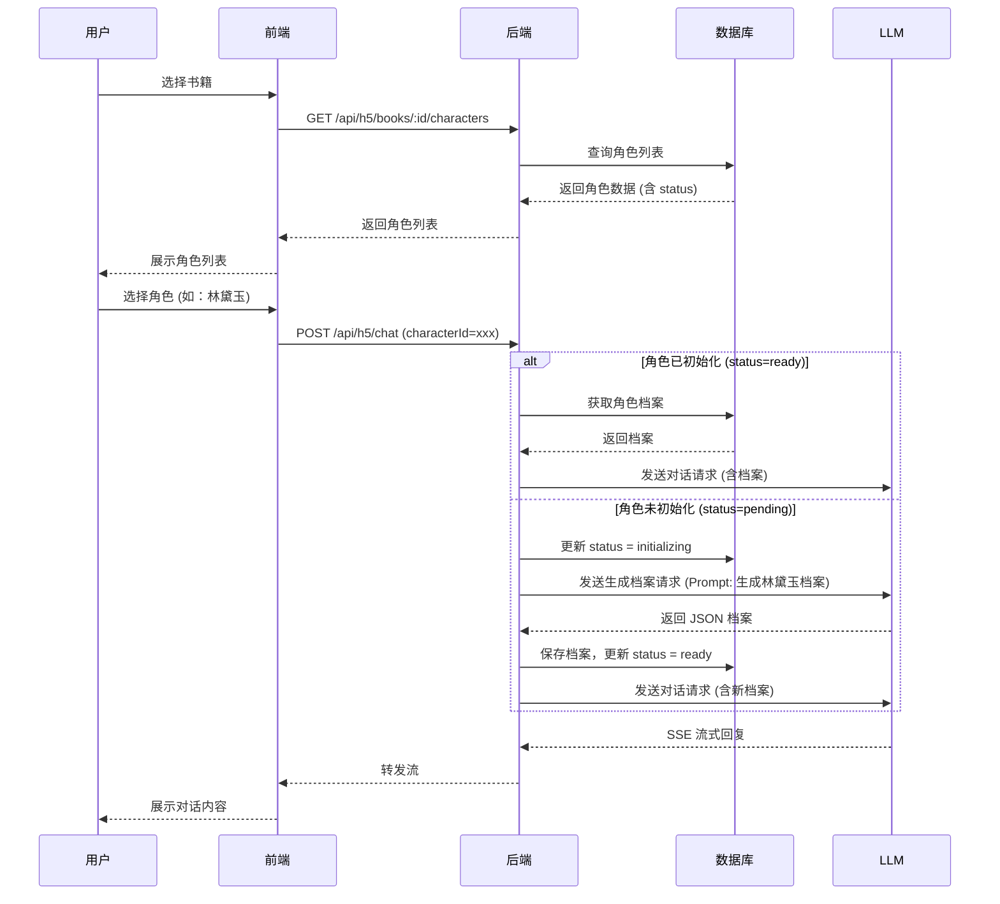
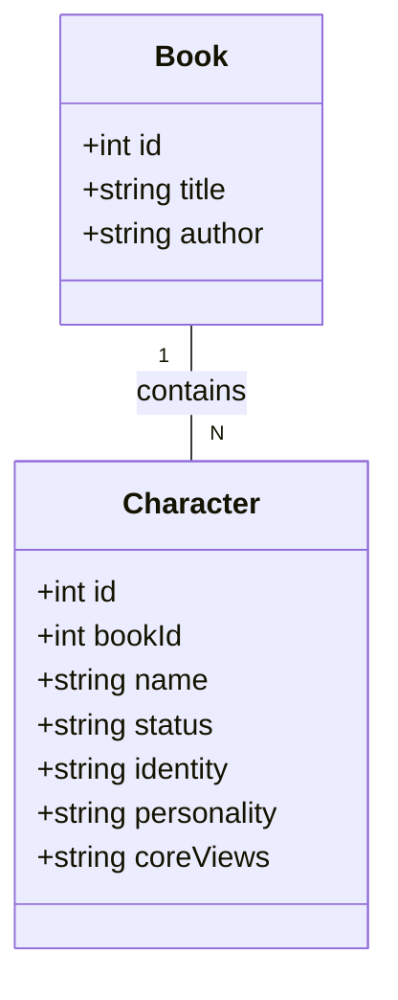
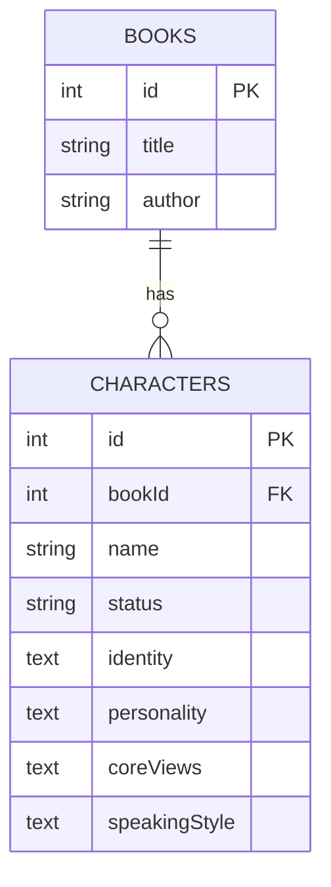

# 详细设计：书中角色对话功能

## 1. 设计目标与定位

### 1.1 核心定位
将"灵魂对话"从单一的"与作者对话"扩展为"与书中任意角色对话"。通过**延迟初始化（Lazy Initialization）**策略，利用 AI 按需生成角色灵魂档案，在降低系统开销的同时，提供沉浸式的多角色交互体验。

### 1.2 设计原则
- **按需生成**：角色灵魂档案仅在用户首次选择该角色时生成，避免海量无效数据的 Token 消耗。
- **无缝体验**：初始化过程对用户透明，通过 Loading 状态平滑过渡，不中断对话流。
- **数据复用**：一旦角色档案生成并入库，后续所有用户对话均直接复用，保证一致性和响应速度。
- **兼容现有架构**：复用现有的 `@提及`（客座角色）逻辑，仅扩展主对话角色的选择范围。

---

## 2. 架构设计

### 2.1 架构总览

```mermaid
graph TD
    User[用户] -->|选择书籍/角色| Frontend[前端 H5]
    Frontend -->|GET /api/h5/books/:id/characters| Backend[后端 API]
    Backend -->|查询| DB[(MySQL)]
    
    User -->|发起对话 (含 characterId)| Frontend
    Frontend -->|POST /api/h5/chat| Backend
    
    Backend -->|检查角色状态| DB
    DB -->|Status: Pending| Backend
    Backend -->|调用 LLM 生成档案| LLM[大模型]
    LLM -->|返回 JSON| Backend
    Backend -->|更新 Status: Ready| DB
    
    Backend -->|构建 System Prompt| LLM
    LLM -->|SSE 流式回复| Backend
    Backend -->|转发流| Frontend
```

### 2.2 模块职责矩阵

| 模块 | 职责 | 关键逻辑 |
| :--- | :--- | :--- |
| **前端 (H5)** | 角色选择器、状态展示 | 展示书籍角色列表；选中未初始化角色时显示"初始化中"；传递 `characterId` 发起对话。 |
| **后端 (API)** | 角色管理、档案生成、对话路由 | 提供角色列表接口；拦截对话请求，触发延迟初始化；组装 System Prompt。 |
| **数据库 (MySQL)** | 角色数据持久化 | 存储角色基础信息及灵魂档案状态 (`pending`/`ready`)。 |
| **LLM 服务** | 档案生成、对话推理 | 根据书名和角色名生成结构化灵魂档案；执行多角色对话推理。 |

---

## 3. 业务流程

### 3.1 业务流程图



### 3.2 业务节点简述
1.  **角色列表加载**：前端请求书籍对应的角色列表。后端返回角色名、简介及状态。
2.  **对话发起与拦截**：前端发起对话请求，携带 `characterId`。后端拦截该请求，检查角色状态。
3.  **延迟初始化**：若状态为 `pending`，后端同步调用 LLM 生成档案。此过程耗时较长（约 3-5 秒），后端需保持连接或返回特定状态码告知前端等待（本方案采用同步等待，前端显示 Loading）。
4.  **Prompt 组装**：获取档案后，后端将其注入 System Prompt，格式为：`你是{角色名}，{身份}。你的性格是... 核心观点是...`。
5.  **流式输出**：LLM 返回对话内容，后端通过 SSE 转发给前端。

---

## 4. 核心设计

### 4.1 延迟初始化策略
- **状态机**：`Character` 表引入 `status` 字段：
  - `pending`: 仅录入名字，未生成档案。
  - `initializing`: 正在生成中（防并发重复生成）。
  - `ready`: 档案已就绪。
- **并发控制**：当多个用户同时选择同一未初始化角色时，利用数据库行锁或 Redis 分布式锁，确保只生成一次档案。

### 4.2 Prompt 组装逻辑
System Prompt 结构：
```text
[主角色设定]
你是 {Character.name}，{Character.identity}。
性格：{Character.personality}
核心观点：{Character.coreViews}
...

[客座角色设定] (如有 @提及)
此时还有另一位参与者 {Guest.name}，他是 {Guest.identity}...

[对话规则]
- 始终以 {Character.name} 的第一人称回答。
- 保持角色设定的说话风格和知识边界。
```

---

## 5. 数模设计

### 5.1 数据模型设计



### 5.2 表设计

**ER 图**


**表结构说明**

| 表名 | 字段名 | 类型 | 约束 | 说明 |
| :--- | :--- | :--- | :--- | :--- |
| `characters` | `id` | INT | PK, Auto | 主键 |
| | `bookId` | INT | FK, Not Null | 关联书籍 ID |
| | `name` | VARCHAR(50) | Not Null | 角色名称 |
| | `status` | VARCHAR(20) | Default 'pending' | 状态：pending/initializing/ready |
| | `identity` | TEXT | Null | 身份设定 |
| | `personality` | TEXT | Null | 性格特征 |
| | `coreViews` | TEXT | Null | 核心观点 (JSON) |
| | `speakingStyle` | TEXT | Null | 说话风格 |
| | `knowledgeLimits`| TEXT | Null | 知识边界 |

---

## 6. 接口设计

### 6.1 获取书籍角色列表
- **Method**: `GET`
- **Path**: `/api/h5/books/:bookId/characters`
- **Response**:
  ```json
  {
    "code": 0,
    "data": [
      { "id": 1, "name": "林黛玉", "status": "ready" },
      { "id": 2, "name": "贾宝玉", "status": "pending" }
    ]
  }
  ```

### 6.2 发起对话 (扩展)
- **Method**: `POST`
- **Path**: `/api/h5/chat`
- **Request Body**:
  ```json
  {
    "messages": [...],
    "bookId": 1,
    "characterId": 1, 
    "sessionId": "红楼梦"
  }
  ```
- **逻辑**:
  - 若 `characterId` 存在且 `status` 为 `pending`，后端同步触发初始化。
  - 初始化完成后，继续执行对话逻辑。
- **Response**: SSE Stream
